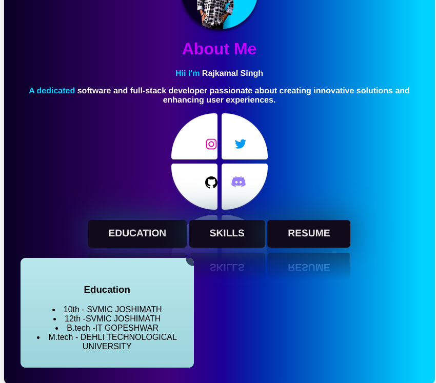

# Personal Portfolio Website

This is a personal portfolio website showcasing details about me, my education, skills, and resume. The website features interactive sections and links to my social media profiles.

### click
https://programerpj69.github.io/AboutCard/

## Features

- **Top Image**: Displays a profile or relevant image at the center-top of the page.
- **About Me Section**: Includes a brief introduction with name and personal details.
- **Social Media Icons**: Links to Facebook, Twitter, Instagram, and LinkedIn profiles.
- **Interactive Buttons**: 
  - **Education**: Displays a card with educational qualifications.
  - **Skills**: Displays a card with a list of skills.
  - **Resume**: Allows users to download a PDF of the resume.
- **Responsive Design**: Adjusts seamlessly for desktop and mobile devices.

## Technology Stack

- **HTML**: Structure of the website.
- **CSS**: Styling for layout and design.
- **JavaScript**: Interactivity for toggling sections and downloading the resume.
- **Font Awesome**: Social media icons.

## Usage

1. Clone the repository:
   ```bash
   git clone https://github.com/your-username/portfolio-website.git
   cd portfolio-website
##How to Customize
Image: Replace the top image in the index.html file by updating the src attribute of the  tag.
Social Media Links: Update the URLs in the social media section of the index.html file.
Resume: Replace path-to-your-resume.pdf in the downloadResume function in script.js with the path to your actual resume file.
Content: Edit the index.html file to add or modify the details about yourself.
Screenshots

#License
This project is licensed under the MIT License - see the LICENSE file for details.

Feel free to reach out for any feedback or suggestions!

yaml
Copy code

---

### Steps to Customize
1. Replace `your-username` with your GitHub username.
2. Add a screenshot of your website in the `assets` folder and replace `path-to-your-screenshot.png` with its relative path.
3. If you need further customization, let me know!

## VIEW (website)


## (Mobile)


